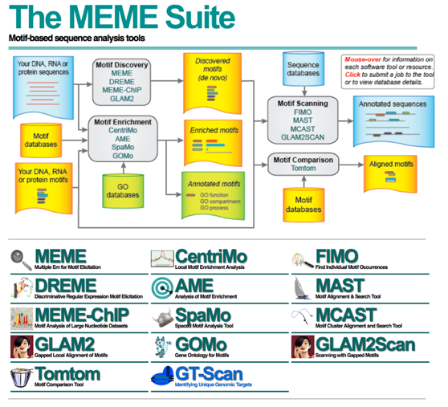
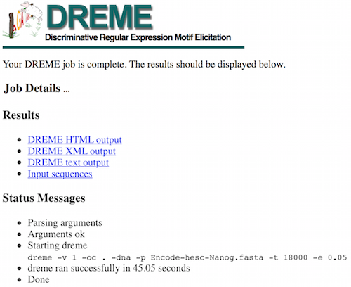
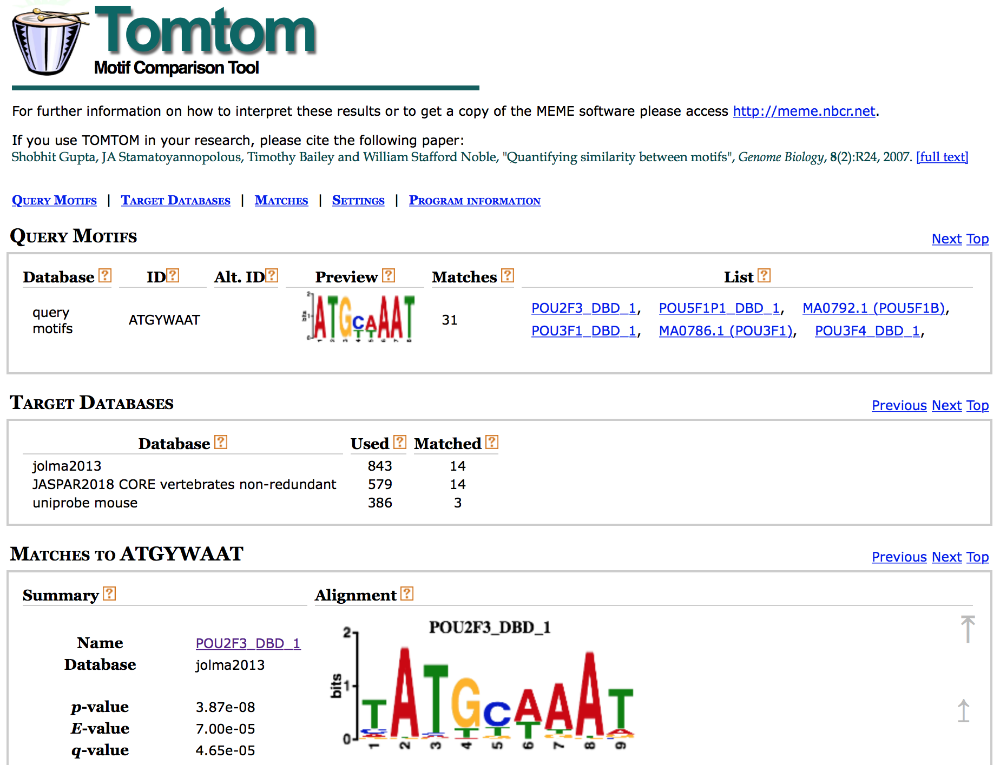
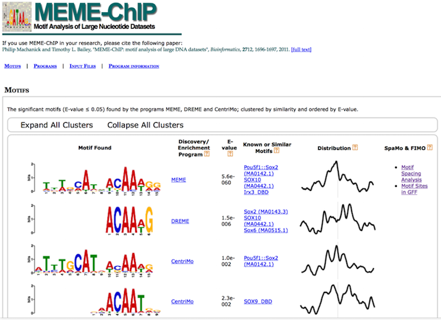

Approximate time: 60 minutes

## Learning Objectives

* Annotating peaks with gene and genomic feature information
* Obtaining biological context for identified binding sites using functional enrichment tools

## Peak Annotation


We have identified regions of the genome that are enriched in the number of aligned reads for each of our transcription factors of interest, Nanog and Pou5f1. These enriched regions represent the likely locations of where these proteins bind to the genome. After we obtain a list of peak coordinates, **it is important to study the biological implications of the protein–DNA bindings**. Certain questions have always been asked: what are the **genomic annotations and the functions** of these peak regions?

Because many cis-regulatory elements are close to TSSs of their targets, it is common to associate each peak to its nearest gene, either upstream or downstream. [ChIPseeker](http://bioconductor.org/packages/release/bioc/vignettes/ChIPseeker/inst/doc/ChIPseeker.html) is an R Bioconductor package for annotating peaks. Additionally, it has various visualization functions to assess peak coverage over chromosomes and profiles of peaks binding to TSS regions. 

### Setting up 

1. Open up RStudio and open up the `chipseq-project` that we created previously.
2. Open up a new R script ('File' -> 'New File' -> 'Rscript'), and save it as `chipseeker.R`

> **NOTE:** This next section assumes you have the `ChIPseeker` package installed for R 3.5 or higher. You will also need one additional library for gene annotation. If you haven't done this please run the following lines of code before proceeding.
>

```
BiocManager::install("ChIPseeker")

```


3. Now we can load all required libraries:

```r
# Load libraries
library(ChIPseeker)
library(TxDb.Hsapiens.UCSC.hg19.knownGene)
library(EnsDb.Hsapiens.v75)
library(clusterProfiler)
library(AnnotationDbi)
```

### Loading data 

Peak annotation is generally performed on your high confidence peak calls (after looking at concordance betwee replicates). While we have a confident peak set for our data, this set is rather small and will not result in anything meaningful in our functional analyses. **We have generated a set of high confidence peak calls using the full dataset.** These were obtained post-IDR analysis, (i.e. concordant peaks between replicates) and are provided in BED format which is optimal input for the ChIPseeker package. 

> **NOTE:** the number of peaks in these BED files are are significantly higher than what we observed with the smaller dataset that we have been working with.

We will need to copy over the appropriate files from O2 to our laptop. You can do this using `FileZilla` or the `scp` command.

Move over the **BED files from O2(`/n/groups/hbctraining/chip-seq/full-dataset/idr/*.bed`) to your laptop**. You will want to copy these files into your chipseq-project **into a new folder called `data/idr-bed`.**

To load the data into our R session, we need to provide the names of our BED files in a list format.

```r

# Load data
samplefiles <- list.files("data/idr-bed", pattern= ".bed", full.names=T)
samplefiles <- as.list(samplefiles)
names(samplefiles) <- c("Nanog", "Pou5f1")

```

Next, we need to **assign annotation databases** generated from UCSC to a variable:

	txdb <- TxDb.Hsapiens.UCSC.hg19.knownGene
	
> **NOTE:** *ChIPseeker supports annotating ChIP-seq data of a wide variety of species if they have transcript annotation TxDb object available.* To find out which genomes have the annotation available follow [this link](http://bioconductor.org/packages/3.5/data/annotation/) and scroll down to "TxDb". Also, if you are interested in creating your own TxDb object you will find [more information here](https://bioconductor.org/packages/devel/bioc/vignettes/GenomicFeatures/inst/doc/GenomicFeatures.pdf). 

### Visualization

First, let's take a look at peak locations across the genome. The `covplot` function calculates **coverage of peak regions** across the genome and generates a figure to visualize this across chromosomes. We do this for the Nanog peaks and find a considerable number of peaks on all chromosomes.

```
# Assign peak data to variables
nanog <- readPeakFile(samplefiles[[1]])
pou5f1 <- readPeakFile(samplefiles[[2]])

# Plot covplot
covplot(nanog, weightCol="V5")

```


Using a window of +/- 1000bp around the TSS of genes we can plot the **density of read count frequency to see where binding is relative to the TSS** or each sample.

```
# Prepare the promotor regions
promoter <- getPromoters(TxDb=txdb, upstream=1000, downstream=1000)

# Calculate the tag matrix
tagMatrixList <- lapply(as.list(samplefiles), getTagMatrix, windows=promoter)

## Profile plots
plotAvgProf(tagMatrixList, xlim=c(-1000, 1000), conf=0.95,resample=500, facet="row")
```


With these plots the confidence interval is estimated by bootstrap method (500 iterations) and is shown in the grey shading that follows each curve. The Nanog peaks exhibit a nice narrow peak at the TSS with small confidence intervals, whereas the Pou5f1 peaks display a bit wider and less smoothed peak around the TSS with larger confidence intervals.

The **heatmap is another method of visualizing the read count frequency** relative to the TSS.

	# Plot heatmap
	tagHeatmap(tagMatrixList, xlim=c(-1000, 1000), color=NULL)


> **NOTE:**  The profile plots and heatmaps are similar to what we did using `deepTools` in the visualization lesson, however here the amplitude of the peak is based on the number of peaks and not on the number of reads aligning (since BAM files are not involved). ChIPseeker is useful for getting a quick look at your data, but for increased accuracy and flexibility in customizing your figure we recommend the `deeptTools` methods.


### Annotation

Many annotation tools use nearest gene methods for assigning a peak to a gene in which the algorithm looks for the nearest TSS to the given genomic coordinates and annotates the peak with that gene. This can be misleading as **binding sites might be located between two start sites of different genes**.

The **`annotatePeak` function**, as part of the ChIPseeker package, uses the nearest gene method described above but also **provides parameters to specify a max distance from the TSS.** For annotating genomic regions, `annotatePeak` will not only give the gene information but also reports detail information when genomic region is Exon or Intron. For instance, ‘Exon (uc002sbe.3/9736, exon 69 of 80)’, means that the peak overlaps with the 69th exon of the 80 exons that transcript uc002sbe.3 possess and the corresponding Entrez gene ID is 9736. 


Let's start by retrieving annotations for our Nanog and Pou5f1 peaks calls:

```
peakAnnoList <- lapply(samplefiles, annotatePeak, TxDb=txdb, 
                       tssRegion=c(-1000, 1000), verbose=FALSE)
```

If you take a look at what is stored in `peakAnnoList`, you will see that the peak annotations have been summarized for you based on genomic features:

```
> peakAnnoList
$Nanog
Annotated peaks generated by ChIPseeker
11023/11035  peaks were annotated
Genomic Annotation Summary:
             Feature  Frequency
9           Promoter 17.1731833
4             5' UTR  0.2358705
3             3' UTR  0.9706976
1           1st Exon  0.5443164
7         Other Exon  1.7781003
2         1st Intron  7.2121927
8       Other Intron 28.2318788
6 Downstream (<=3kb)  0.9434818
5  Distal Intergenic 42.9102785

$Pou5f1
Annotated peaks generated by ChIPseeker
3242/3251  peaks were annotated
Genomic Annotation Summary:
             Feature  Frequency
9           Promoter  3.7939543
4             5' UTR  0.1542258
3             3' UTR  1.0795805
1           1st Exon  1.3263418
7         Other Exon  1.6347933
2         1st Intron  7.4336829
8       Other Intron 30.9685379
6 Downstream (<=3kb)  0.9561999
5  Distal Intergenic 52.6526835
```

ChIPseeker provides several functions to visualize the annotations using various plots. We will demonstrate a few of these using the Nanog sample. We will also show you how some of the functions can support comparing annotation information across samples.

### Pie chart of genomic feature representation

```
plotAnnoPie(peakAnnoList[["Nanog"]])
```


### Vennpie of genomic region annotation

```
vennpie(peakAnnoList[["Nanog"]])
```


### Barchart of genomic feature representation

```
plotAnnoBar(peakAnnoList)

```


### Distribution of TF-binding loci relative to TSS

```
plotDistToTSS(peakAnnoList, title="Distribution of transcription factor-binding loci \n relative to TSS")
```


Finally, it would be nice to have the **annotations for each peak call written to file**, as it can be useful to browse the data and subset calls of interest. The annotation information is stored in the `peakAnnoList` object. To retrieve it we use the following syntax:

	nanog_annot <- data.frame(peakAnnoList[["Nanog"]]@anno)

Take a look at this data frame. You should see columns corresponding to your input BED file and addditional columns containing nearest gene(s), the distance from peak to the TSS of its nearest gene, genomic feature annotation of the peak and other information. Since some annotations may overlap, ChIPseeker has adopted the following priority in how it lists information:

* Promoter
* 5’ UTR
* 3’ UTR
* Exon
* Intron
* Downstream (defined as the downstream of gene end)
* Intergenic

One thing you will notice is that the gene identifiers that are listed are EntrezIDs. It would be easier to browse through the results if we had gene symbols. We will obtain this information using `AnnotationDbi`, an R package that provides an interface for connecting and querying various annotation databases using SQLite data storage. The AnnotationDbi packages can query the OrgDb, TxDb, EnsDb, Go.db, and BioMart annotations. There is [helpful documentation](https://bioconductor.org/packages/release/bioc/vignettes/AnnotationDbi/inst/doc/IntroToAnnotationPackages.pdf) available to reference when extracting data from any of these databases.

Although we have been using the TxDb database with ChIPseeker, there is limited options as to what other identifiers can be retrieved.

```r

keytypes(TxDb.Hsapiens.UCSC.hg19.knownGene)
[1] "CDSID"    "CDSNAME"  "EXONID"   "EXONNAME" "GENEID"   "TXID"     "TXNAME"  
```

Since we want to map our EntrezIDs to gene symbols, we will need to use another database. The `EnsDb.Hsapiens.v75` database corresponds to hg19, and so is an appropriate option.


```
# Get entrez gene Ids
entrez <- as.character(nanog_annot$geneId)

# Return the gene symbol for the set of Entrez IDs
annotations_edb <- AnnotationDbi::select(EnsDb.Hsapiens.v75,
                                           keys = entrez,
                                           columns = c("GENENAME"),
                                           keytype = "ENTREZID")
# Write to file
nanog_annot %>% 
  left_join(annotations_edb, by=c("geneId"="ENTREZID")) %>% 
  write.table(file="results/Nanog_peak_annotation.txt", sep="\t", quote=F, row.names=F)
```


## Functional enrichment: R-based tools

Once we have obtained gene annotations for our peak calls, we can perform functional enrichment analysis to **identify predominant biological themes among these genes** by incorporating knowledge from biological ontologies such as Gene Ontology, KEGG and Reactome. The gene lists we have obtained through annotation can be interepreted using freely available web- and R-based tools. In this workshop we will focus on the latter, but we will also mention the former and provide resources if you are interested in web-based tools.


### Over-representation analysis

There are a plethora of functional enrichment tools that perform some type of over-representation analysis by querying databases containing information about gene function and interactions. Querying these databases for gene function requires the use of a consistent vocabulary to describe gene function. One of the **most widely-used vocabularies is the Gene Ontology (GO)**. This vocabulary was established by the Gene Ontology project, and the words in the vocabulary are referred to as GO terms.

We will be using [`clusterProfiler`](http://bioconductor.org/packages/release/bioc/html/clusterProfiler.html) to perform over-representation analysis on GO terms associated with our list of significant genes. The tool takes as input a significant gene list and a background gene list and performs statistical enrichment analysis using hypergeometric testing. The basic arguments allow the user to select the appropriate organism and GO ontology (BP, CC, MF) to test.

Let's start with our gene list from **Nanog annotations** and use them as input for a **GO enrichment analysis**.

```r
# Run GO enrichment analysis 
ego <- enrichGO(gene = entrez, 
                    keytype = "ENTREZID", 
                    OrgDb = org.Hs.eg.db, 
                    ont = "BP", 
                    pAdjustMethod = "BH", 
                    qvalueCutoff = 0.05, 
                    readable = TRUE)

# Output results from GO analysis to a table
cluster_summary <- data.frame(ego)
write.csv(cluster_summary, "results/clusterProfiler_Nanog.csv")
```

We can visualize the results using the `dotplot` function. We find many terms related to **development and differentiation** and amongst those in the bottom half of the list we see 'stem cell population maintenance'. Functionally, Nanog blocks differentiation. Thus, negative regulation of Nanog is required to promote differentiation during embryonic development. Recently, Nanog has been shown to be involved in neural stem cell differentiation which might explain the abundance of neuro terms we observe.

```
# Dotplot visualization
dotplot(ego, showCategory=50)
```


Let's try a **KEGG pathway enrichment** and visualize again using the the dotplot. Again, we see a relevant pathway 'Signaling pathways regulating pluripotency of stem cells'.

```
ekegg <- enrichKEGG(gene = entrez,
                 organism = 'hsa',
                 pvalueCutoff = 0.05)

dotplot(kk)
```


### Multiple samples

Our dataset consist of two different transcription factor peak calls, so it would be useful to compare functional enrichment results from both. We will do this using the `compareCluster` function. We see similar terms showing up, and in particular the stem cell term is more significant (and a higher gene ratio) in the Pou5f1 data.

```
# Create a list with genes from each sample
genes = lapply(peakAnnoList, function(i) as.data.frame(i)$geneId)

# Run KEGG analysis
compKEGG <- compareCluster(geneCluster = genes, 
                         fun = "enrichKEGG",
                         organism = "human",
                         pvalueCutoff  = 0.05, 
                         pAdjustMethod = "BH")
plot(compKEGG, showCategory = 20, title = "KEGG Pathway Enrichment Analysis")
```

 


## Functional enrichment: Web-based tools

## Motif discovery


After identifying likely binding sites, downstream analyses will often include: 

1. determining the binding motifs for the protein of interest
2. identifying which genes are associated with the binding sites and exploring whether there is any associated enrichment of processes, pathways, or networks.

We will explore a few useful web-based tools for performing these analyses using our Nanog peak calls.

Since the motif and functional enrichment analyses are unlikely to give reliable results using only the 32.8 Mb of reads mapping to chr12,  we will use the **full set of peak calls output from the IDR analysis**.

## Set-up

Start an interactive session:

```bash
$ srun --pty -p short -t 0-12:00 --mem 8G --reservation=HBC bash	
```

Extract the first three columns of the IDR peak calls for the whole genome of Nanog:

```bash
$ cd ~/chipseq/results

$ mkdir functional_analysis

$ cd functional_analysis

$ cp /n/groups/hbctraining/chip-seq/full-dataset/idr/*.bed .

$ cut -f 1,2,3 Nanog-idr-merged.bed  > Nanog-idr-merged-great.bed
```

To extract the sequences corresponding to the peak coordinates for motif discovery, we will use the [bedtools](http://bedtools.readthedocs.org/en/latest/content/bedtools-suite.html) suite of tools. The `getfasta` command extracts sequences from a reference fasta file for each of the coordinates defined in a BED/GFF/VCF file. 

```bash
$ module load gcc/6.2.0 bedtools/2.26.0

$ bedtools getfasta -fi \
/n/groups/shared_databases/igenome/Homo_sapiens/UCSC/hg19/Sequence/WholeGenomeFasta/genome.fa \
-bed Nanog-idr-merged-great.bed \
-fo Nanog-idr-merged-dreme.fasta
```

Using `scp` or **FileZilla** on your local computer, transfer `Nanog-idr-merged-great.bed` and `Nanog-idr-merged-dreme.fasta` to your Desktop.

```bash
$ scp username@transfer.rc.hms.harvard.edu:~/chipseq/results/functional_analysis/*merged-* Desktop/
```

## Functional enrichment analysis

We will use [GREAT](http://bejerano.stanford.edu/great/public/html/index.php) to perform the functional enrichment analysis. GREAT takes a list of regions, associates them with nearby genes, and then analyzes the gene annotations to assign biological meaning to the data.

 Open [GREAT](http://bejerano.stanford.edu/great/public/html/index.php), and perform the following steps:

1. Choose the `Nanog-idr-merged-great.bed` file and use the `Whole genome` for Background regions. Click Submit. GREAT provides the output in HTML format organized by section.

2. Expand the `Job Description` section. Click on `View all genomic region-gene associations`. Note that each associated gene is listed with location from the transcription start site as shown below:

	

	Within this section, you have the option to download the list of genes associated with Nanog binding sites or you could view all of the binding sites as a custom track in the UCSC Genome Browser.
	
3. Scroll down to the `Region-Gene Association Graphs`. Observe the graphics displaying the summary of the number of genes associated with each binding site and the binding site locations relative to the transcription start sites of the associated genes
	
	

4. Below the `Region-Gene Association Graphs` are the `Global Controls`, where you can select the annotation information to display. Keep the default settings and scroll down to view the information displayed. 

5. Explore the GO Biological Process terms associated with the Nanog binding sites. Notice the options available at the top of the tables for exporting data, changing settings, and visualization.

	
	
	GREAT calculates two measures of statistical enrichment: "one using a binomial test over genomic regions and one using a hypergeometric test over genes" [[2](http://bejerano.stanford.edu/help/display/GREAT/Statistics)]. Each test has its own biases, which are compensated for by the other test. 
	
6. Click on the term `negative regulation of stem cell differentiation`:

	
	
	Note that summary information about the binding sites of Nanog for genes associated with this GO term are displayed.
	
7. Expand the section for `This term's genomic region-gene association tables`. Notice that you have the option to download the gene table.

8. Click on `NOTCH1`. Explore the binding regions directly within the UCSC Genome Browser.


## Motif discovery



To identify over-represented motifs, we will use DREME from the MEME suite of sequence analysis tools. [DREME](http://meme-suite.org/tools/dreme) is a motif discovery algorithm designed to find short, core DNA-binding motifs of eukaryotic transcription factors and is optimized to handle large ChIP-seq data sets.

DREME is tailored to eukaryotic data by focusing on short motifs (4 to 8 nucleotides) encompassing the DNA-binding region of most eukaryotic monomeric transcription factors. Therefore it may miss wider motifs due to binding by large transcription factor complexes.


### DREME

Visit the [DREME website](http://meme-suite.org/tools/dreme) and perform the following steps:

1. Select the downloaded `Nanog-idr-merged-dreme.fasta` as input to DREME
2. Enter your email address so that DREME can email you once the analysis is complete
3. Enter a job description so you will recognize which job has been emailed to you and then start the search

You will be shown a status page describing the inputs and the selected parameters, as well as links to the results at the top of the screen.



This may take some time depending on the server load and the size of the file. While you wait, take a look at the [expected results](http://meme-suite.org/info/status?service=DREME&id=appDREME_5.0.115330443284501107678163).

http://meme-suite.org/opal-jobs/appDREME_5.0.115330443284501107678163/dreme.html


DREME’s HTML output provides a list of Discovered Motifs displayed as sequence logos (in the forward and reverse complement (RC) orientations), along with an E-value for the significance of the result. 

Motifs are significantly enriched if the fraction of sequences in the input dataset matching the motif is significantly different from the fraction of sequences in the background dataset using Fisher’s Exact Test. Typically, background dataset is either similar data from a different ChIP-seq experiment or shuffled versions of the input dataset [[1](http://www.ncbi.nlm.nih.gov/pmc/articles/PMC3106199/)].

Clicking on `More` displays the number of times the motif was identified in the Nanog dataset (positives) versus the background dataset (negatives). The `Details` section displays the number of sequences matching the motif, while `Enriched Matching Words` displays the number of times the motif was identified in the sequences (more than one word possible per sequence).

### Tomtom
To determine if the identified motifs resemble the binding motifs of known transcription factors, we can submit the motifs to Tomtom, which searches a database of known motifs to find potential matches and provides a statistical measure of motif-motif similarity. We can run the analysis individually for each motif prediction by performing the following steps:

1. Click on the `Submit / Download` button for motif `ATGYWAAT` in the DREME output
2. A dialog box will appear asking you to Select what you want to do or Select a program. Select `Tomtom` and click `Submit`. This takes you to the input page. 
3. Tomtom allows you to select the database you wish to search against. Keep the default parameters selected, but keep in mind that there are other options when performing your own analyses.
4. Enter your email address and job description and start the search.

You will be shown a status page describing the inputs and the selected parameters, as well as a link to the results at the top of the screen. Clicking the link displays an output page that is continually updated until the analysis has completed. Like DREME, Tomtom will also email you the results.

The HTML output for Tomtom shows a list of possible motif matches for the DREME motif prediction generated from your Nanog regions. Clicking on the match name shows you an alignment of the predicted motif versus the match.



The short genomic regions identified by ChIP-seq are generally very highly enriched with binding sites of the ChIP-ed transcription factor, but Nanog is not in the databases of known motifs. The regions identified also tend to be enriched for the binding sites of other transcription factors that bind *cooperatively or competitively* with the ChIP-ed transcription factor.

If we compare our results with what is known about our transcription factor, Nanog, we find that Sox2 and Pou5f1 (Oct4) co-regulate many of the same genes as Nanog. 


[https://www.qiagen.com/us/shop/genes-and-pathways/pathway-details/?pwid=309](https://www.qiagen.com/us/shop/genes-and-pathways/pathway-details/?pwid=309)


### MEME-ChIP

MEME-ChIP is a tool that is part of the MEME Suite that is specifically designed for ChIP-seq analyses. MEME-ChIP performs DREME and Tomtom analysis in addition to using tools to assess which motifs are most centrally enriched (motifs should be centered in the peaks) and to combine related motifs into similarity clusters. It is able to identify longer motifs < 30bp, but takes much longer to run.

> 


## Other functional analysis tools

ChIPseeker is an R package for annotating ChIP-seq data analysis. It supports annotating ChIP peaks and provides functions to visualize ChIP peaks coverage over chromosomes and profiles of peaks binding to TSS regions. Comparison of ChIP peak profiles and annotation are also supported, and can be useful to compare biological replicates. Several visualization functions are implemented to visualize the peak annotation and statistical tools for enrichment analyses of functional annotations. If interested, there are [materials](https://hbctraining.github.io/Intro-to-ChIPseq/lessons/ChIPseeker_functional_analysis.html) available for using ChIPseeker for functional analysis.


