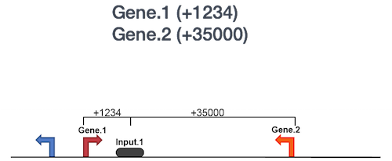
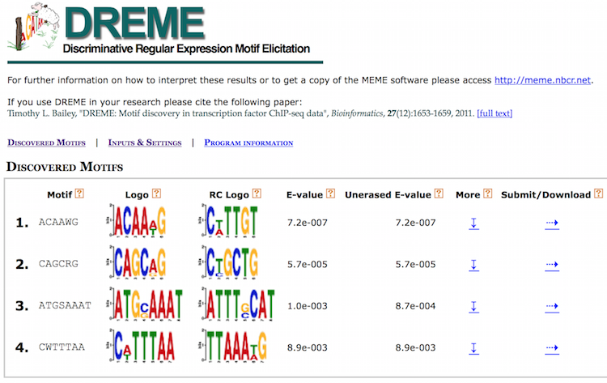

Approximate time: 40 minutes

## Learning Objectives

* to explore web-based tools for motif discovery and functional enrichment analysis of the peak calls

# Web-based functional analysis and motif discovery


We have identified regions of the genome where the number of reads aligning to these areas differ significantly between our Nanog IP samples and the input controls. These enriched regions represent the likely locations of where Nanog binds to the genome. 

After identifying likely binding sites, downstream analyses will often include: 

1. determining the binding motifs for the protein of interest
2. identifying which genes are associated with the binding sites and exploring whether there is any associated enrichment of processes, pathways, or networks.

We will explore a few useful web-based tools for performing these analyses using our Nanog peak calls.

Since the motif and functional enrichment analyses are unlikely to give reliable results using only the 32.8 Mb of reads mapping to chr12,  we will use the **full set of peak calls output from the IDR analysis**.

## Set-up

Start an interactive session:

```bash
$ srun --pty -p short -t 0-12:00 --mem 8G --reservation=HBC bash	
```

Extract the first three columns of the IDR peak calls for the whole genome of Nanog:

```bash
$ cd ~/chipseq/results

$ mkdir functional_analysis

$ cd functional_analysis

$ cp /n/groups/hbctraining/chip-seq/full-dataset/idr/*.bed .

$ cut -f 1,2,3 Nanog-idr-merged.bed  > Nanog-idr-merged-great.bed
```

To extract the sequences corresponding to the peak coordinates for motif discovery, we will use the [bedtools](http://bedtools.readthedocs.org/en/latest/content/bedtools-suite.html) suite of tools. The `getfasta` command extracts sequences from a reference fasta file for each of the coordinates defined in a BED/GFF/VCF file. 

```bash
$ module load gcc/6.2.0 bedtools/2.26.0

$ bedtools getfasta -fi \
/n/groups/shared_databases/igenome/Homo_sapiens/UCSC/hg19/Sequence/WholeGenomeFasta/genome.fa \
-bed Nanog-idr-merged-great.bed \
-fo Nanog-idr-merged-dreme.fasta
```

Using `scp` or **FileZilla** on your local computer, transfer `Nanog-idr-merged-great.bed` and `Nanog-idr-merged-dreme.fasta` to your Desktop.

```bash
$ scp username@transfer.rc.hms.harvard.edu:~/chipseq/results/functional_analysis/*merged-* Desktop/
```

## Functional enrichment analysis

We will use [GREAT](http://bejerano.stanford.edu/great/public/html/index.php) to perform the functional enrichment analysis. GREAT takes a list of regions, associates them with nearby genes, and then analyzes the gene annotations to assign biological meaning to the data.

 Open [GREAT](http://bejerano.stanford.edu/great/public/html/index.php), and perform the following steps:

1. Choose the `Nanog-idr-merged-great.bed` file and use the `Whole genome` for Background regions. Click Submit. GREAT provides the output in HTML format organized by section.

2. Expand the `Job Description` section. Click on `View all genomic region-gene associations`. Note that each associated gene is listed with location from the transcription start site as shown below:

	

	Within this section, you have the option to download the list of genes associated with Nanog binding sites or you could view all of the binding sites as a custom track in the UCSC Genome Browser.
	
3. Scroll down to the `Region-Gene Association Graphs`. Observe the graphics displaying the summary of the number of genes associated with each binding site and the binding site locations relative to the transcription start sites of the associated genes
	
	

4. Below the `Region-Gene Association Graphs` are the `Global Controls`, where you can select the annotation information to display. Keep the default settings and scroll down to view the information displayed. 

5. Explore the GO Biological Process terms associated with the Nanog binding sites. Notice the options available at the top of the tables for exporting data, changing settings, and visualization.

	
	
	GREAT calculates two measures of statistical enrichment: "one using a binomial test over genomic regions and one using a hypergeometric test over genes" [[2](http://bejerano.stanford.edu/help/display/GREAT/Statistics)]. Each test has its own biases, which are compensated for by the other test. 
	
6. Click on the term `negative regulation of stem cell differentiation`:

	
	
	Note that summary information about the binding sites of Nanog for genes associated with this GO term are displayed.
	
7. Expand the section for `This term's genomic region-gene association tables`. Notice that you have the option to download the gene table.

8. Click on `NOTCH1`. Explore the binding regions directly within the UCSC Genome Browser.


## Motif discovery


To identify over-represented motifs, we will use DREME from the MEME suite of sequence analysis tools. [DREME](http://meme-suite.org/tools/dreme) is a motif discovery algorithm designed to find short, core DNA-binding motifs of eukaryotic transcription factors and is optimized to handle large ChIP-seq data sets.

DREME is tailored to eukaryotic data by focusing on short motifs (4 to 8 nucleotides) encompassing the DNA-binding region of most eukaryotic monomeric transcription factors. Therefore it may miss wider motifs due to binding by large transcription factor complexes.


### DREME

Visit the [DREME website](http://meme-suite.org/tools/dreme) and perform the following steps:

1. Select the downloaded `Nanog-idr-merged-dreme.fasta` as input to DREME
2. Enter your email address so that DREME can email you once the analysis is complete
3. Enter a job description so you will recognize which job has been emailed to you and then start the search

You will be shown a status page describing the inputs and the selected parameters, as well as links to the results at the top of the screen.


This may take some time depending on the server load and the size of the file. While you wait, take a look at the [expected results](http://meme-suite.org/info/status?service=DREME&id=appDREME_5.0.115330443284501107678163).



DREME’s HTML output provides a list of Discovered Motifs displayed as sequence logos (in the forward and reverse complement (RC) orientations), along with an E-value for the significance of the result. 

Motifs are significantly enriched if the fraction of sequences in the input dataset matching the motif is significantly different from the fraction of sequences in the background dataset using Fisher’s Exact Test. Typically, background dataset is either similar data from a different ChIP-seq experiment or shuffled versions of the input dataset [[1](http://www.ncbi.nlm.nih.gov/pmc/articles/PMC3106199/)].

Clicking on `More` displays the number of times the motif was identified in the Nanog dataset (positives) versus the background dataset (negatives). The `Details` section displays the number of sequences matching the motif, while `Enriched Matching Words` displays the number of times the motif was identified in the sequences (more than one word possible per sequence).

### Tomtom
To determine if the identified motifs resemble the binding motifs of known transcription factors, we can submit the motifs to Tomtom, which searches a database of known motifs to find potential matches and provides a statistical measure of motif-motif similarity. We can run the analysis individually for each motif prediction by performing the following steps:

1. Click on the `Submit / Download` button for motif `ATGYWAAT` in the DREME output
2. A dialog box will appear asking you to Select what you want to do or Select a program. Select `Tomtom` and click `Submit`. This takes you to the input page. 
3. Tomtom allows you to select the database you wish to search against. Keep the default parameters selected, but keep in mind that there are other options when performing your own analyses.
4. Enter your email address and job description and start the search.

You will be shown a status page describing the inputs and the selected parameters, as well as a link to the results at the top of the screen. Clicking the link displays an output page that is continually updated until the analysis has completed. Like DREME, Tomtom will also email you the results.

The HTML output for Tomtom shows a list of possible motif matches for the DREME motif prediction generated from your Nanog regions. Clicking on the match name shows you an alignment of the predicted motif versus the match.


The short genomic regions identified by ChIP-seq are generally very highly enriched with binding sites of the ChIP-ed transcription factor, but Nanog is not in the databases of known motifs. The regions identified also tend to be enriched for the binding sites of other transcription factors that bind *cooperatively or competitively* with the ChIP-ed transcription factor.

If we compare our results with what is known about our transcription factor, Nanog, we find that Sox2 and Pou5f1 (Oct4) co-regulate many of the same genes as Nanog. 


[https://www.qiagen.com/us/shop/genes-and-pathways/pathway-details/?pwid=309](https://www.qiagen.com/us/shop/genes-and-pathways/pathway-details/?pwid=309)


### MEME-ChIP

MEME-ChIP is a tool that is part of the MEME Suite that is specifically designed for ChIP-seq analyses. MEME-ChIP performs DREME and Tomtom analysis in addition to using tools to assess which motifs are most centrally enriched (motifs should be centered in the peaks) and to combine related motifs into similarity clusters. It is able to identify longer motifs < 30bp, but takes much longer to run.

> 


## Other functional analysis tools

ChIPseeker is an R package for annotating ChIP-seq data analysis. It supports annotating ChIP peaks and provides functions to visualize ChIP peaks coverage over chromosomes and profiles of peaks binding to TSS regions. Comparison of ChIP peak profiles and annotation are also supported, and can be useful to compare biological replicates. Several visualization functions are implemented to visualize the peak annotation and statistical tools for enrichment analyses of functional annotations. If interested, there are [materials](https://hbctraining.github.io/Intro-to-ChIPseq/lessons/ChIPseeker_functional_analysis.html) available for using ChIPseeker for functional analysis.


